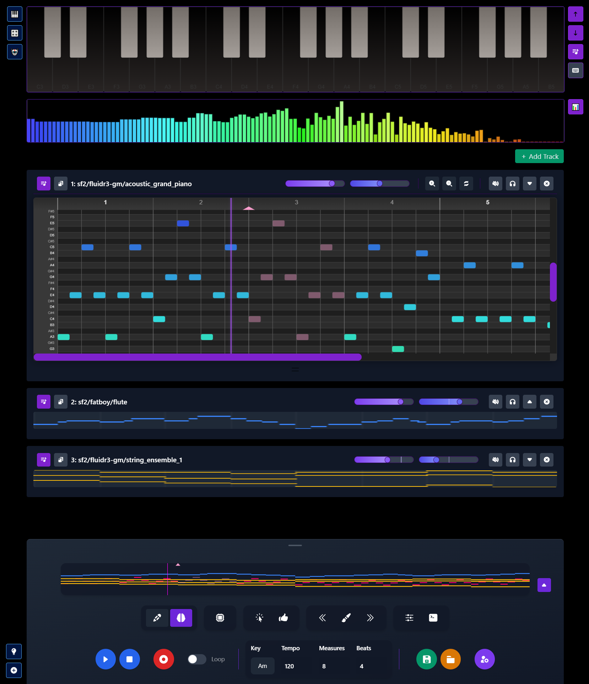

# Sequenzia
AI-Native DAW

## Overview
Sequenzia is a modern, web-based Digital Audio Workstation (DAW) with integrated AI capabilities. It combines traditional music production tools with artificial intelligence to enhance the creative process.

🎵 **Try it now**: [https://alacrity-ai.github.io/sequenzia/](https://alacrity-ai.github.io/sequenzia/)



## Features
- 🎹 Multi-track piano roll sequencer
- 🎨 Real-time waveform visualization with multiple view modes
- 🤖 AI-powered music generation and extension
- 🎵 Multiple instrument support
- 📊 Global mini-contour view
- ⚡ Built with Vite for optimal performance
- 🎚️ Transport controls with loop functionality
- 🎼 Variable note durations and snap resolutions
- 💾 Export to WAV, MIDI, and JSON formats

## Getting Started

### Prerequisites
- Node.js (version that supports ESM)
- npm or yarn

### Installation
```bash
# Clone the repository
git clone https://github.com/alacrity-ai/sequenzia.git

# Navigate to project directory
cd sequenzia

# Install dependencies
npm install

# Start development server
npm run dev
```

### Building for Production
```bash
npm run build
```

The built files will be in the `dist` directory.

## AI Features
- Track extension: Generate additional measures that match your musical style
- Inpainting: Fill in selected regions with AI-generated music
- Context-aware generation using surrounding musical material

Note: AI features require an OpenAI API key to be configured.

## Technical Stack
- Vite.js for build tooling and development
- Web Audio API for sound generation
- Canvas API for visualization
- Tailwind CSS for styling

## Contributing
Contributions are welcome! Here's how you can help:

1. Fork the repository
2. Create a new branch (`git checkout -b feature/amazing-feature`)
3. Make your changes
4. Commit your changes (`git commit -m 'Add some amazing feature'`)
5. Push to the branch (`git push origin feature/amazing-feature`)
6. Open a Pull Request

Please ensure your code follows the existing style and includes appropriate tests.

## License
MIT License

Copyright (c) 2024 Sequenzia

Permission is hereby granted, free of charge, to any person obtaining a copy
of this software and associated documentation files (the "Software"), to deal
in the Software without restriction, including without limitation the rights
to use, copy, modify, merge, publish, distribute, sublicense, and/or sell
copies of the Software, and to permit persons to whom the Software is
furnished to do so, subject to the following conditions:

The above copyright notice and this permission notice shall be included in all
copies or substantial portions of the Software.

THE SOFTWARE IS PROVIDED "AS IS", WITHOUT WARRANTY OF ANY KIND, EXPRESS OR
IMPLIED, INCLUDING BUT NOT LIMITED TO THE WARRANTIES OF MERCHANTABILITY,
FITNESS FOR A PARTICULAR PURPOSE AND NONINFRINGEMENT. IN NO EVENT SHALL THE
AUTHORS OR COPYRIGHT HOLDERS BE LIABLE FOR ANY CLAIM, DAMAGES OR OTHER
LIABILITY, WHETHER IN AN ACTION OF CONTRACT, TORT OR OTHERWISE, ARISING FROM,
OUT OF OR IN CONNECTION WITH THE SOFTWARE OR THE USE OR OTHER DEALINGS IN THE
SOFTWARE.


